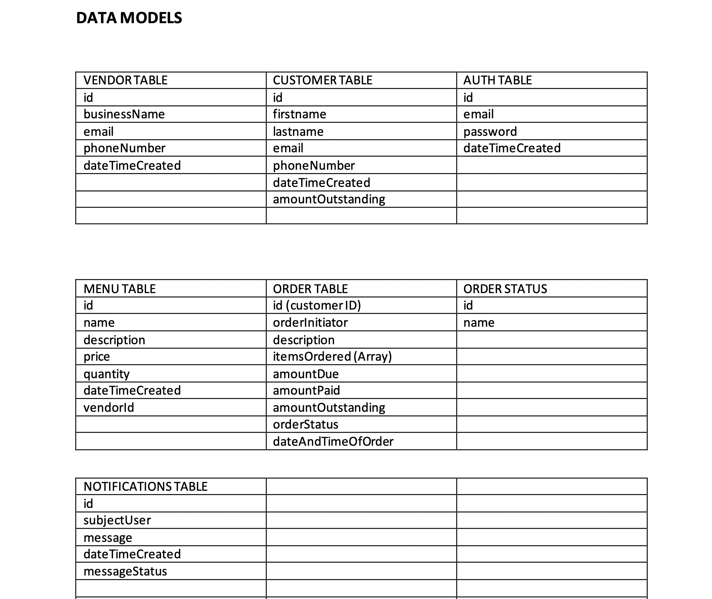

# FOOD VENDOR APPLICATION API
- This is a food vendor application api to manage Customers, Vendors, Orders and Menu.
The Api is built using the MEN(Mongodb, Express and Nodejs) stack.

## Users
### This application would have two types of users:
- The vendor
- The customer

### Functional Requirements (Vendor)
- The vendor should be able to sign up with name, email and phone number.
- The vendor should be able to set a password.
- The vendor should be able to log in with email and password.
- The vendor should be able to create a menu.
- The vendor should be able to update a menu.
- The vendor should be able to view orders

### Functional Requirements (Customer)
- Customer should be able to signup with name, email and phone number.
- Customer should be able to set a password.
- Customer should be able to log in with email and password.
- Customer should be able to purchase food from the available menu that has been put up by the
vendor.

## DATA MODEL
---

### To Do
#### Vendor
- The vendor should be able to update order status.
- The vendor should be able to generate a daily report of sales.
- The vendor should be able to send notifications to the customer on available menu or debts,
order progress and other relevant information.

#### Customer
- Customer should be able to pre-order food.
- Customer should be able to cancel order.
- Payment for food purchased or pre-ordered (No payment integration required. A flip of payment status is sufficient).

